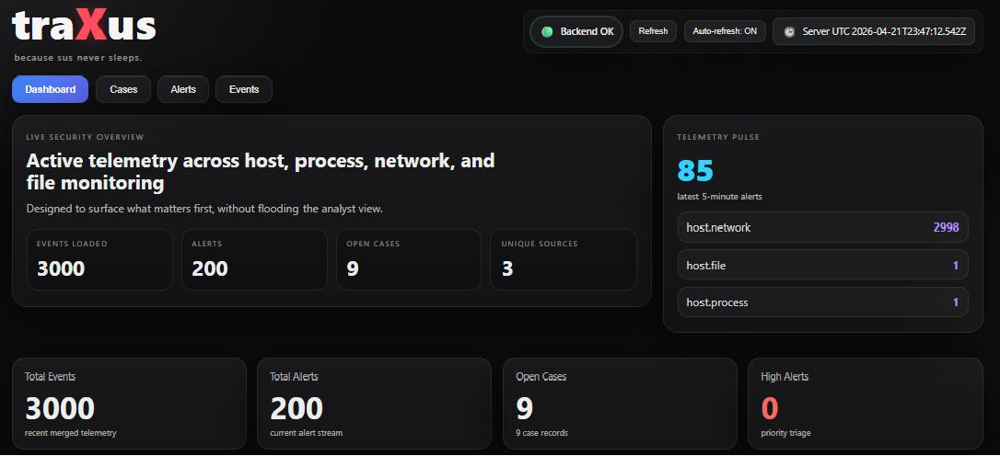
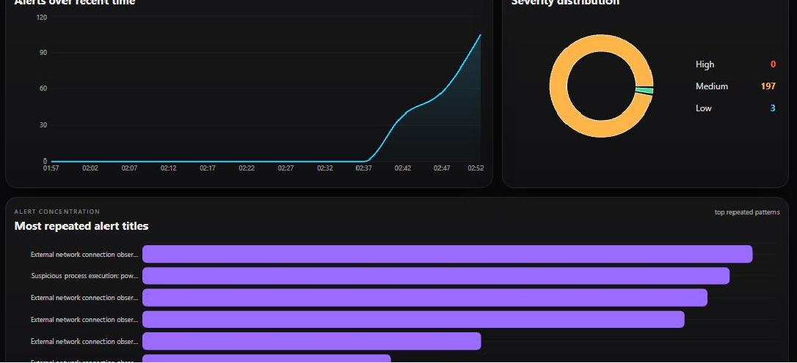
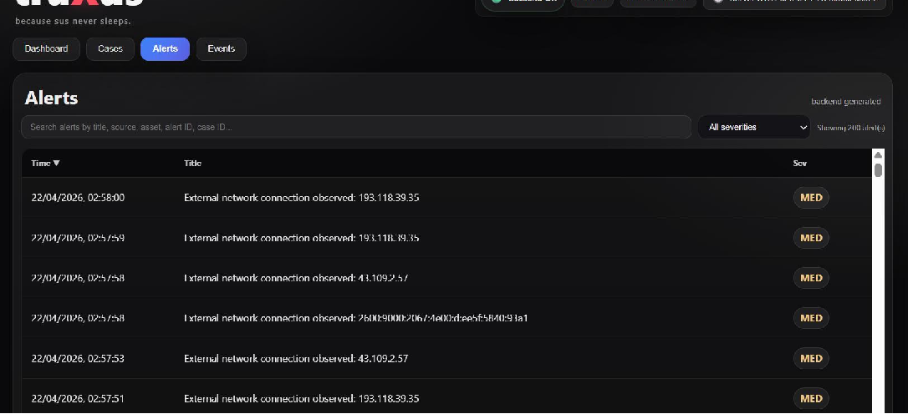
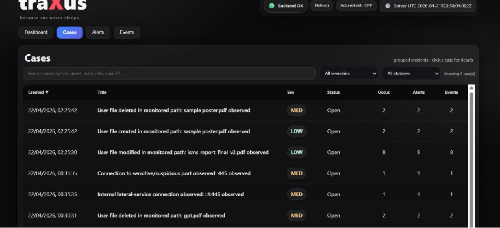
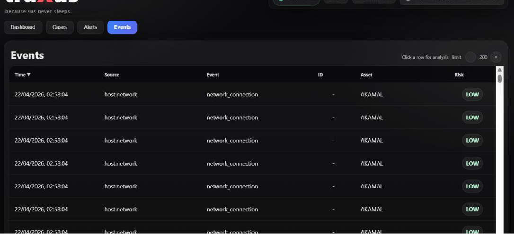
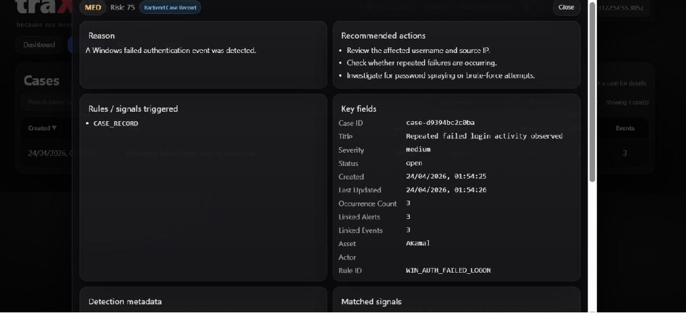
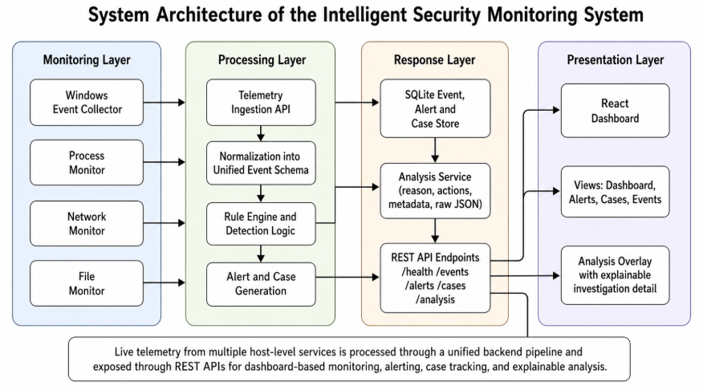
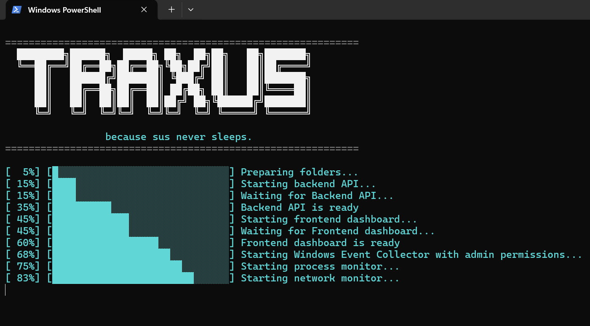

<h1>traXus — <small><em>because sus never sleeps.</em></small></h1>


<p align="center">
  <strong>
    A lightweight SIEM-style security monitoring platform for Windows telemetry,
    explainable detections, alert triage, and incident case management.
  </strong>
</p>

<p align="center">
  
  
  
  
  
  
</p>

<p align="center">
  
</p>

---

## Overview

traXus is an intelligent security monitoring system designed to collect, normalize, analyse, and visualise security telemetry from a Windows endpoint.

The platform combines Windows Security Event Logs, process activity, network connections, and filesystem events into a unified backend pipeline. A rule-based detection engine evaluates incoming telemetry, assigns contextual risk and severity, creates explainable alerts, and promotes incident-worthy activity into grouped cases.

The project focuses on transparency and analyst usability. Every detection can be traced back to its triggering rule, relevant event fields, risk context, recommended actions, linked records, and raw event data.

---

## Key Features

* Multi-source Windows endpoint telemetry collection
* Windows Security Event Log monitoring
* Process, network, and filesystem activity monitoring
* Unified event normalization
* Rule-based threat detection
* Contextual risk scoring and severity classification
* Alert generation with recommended response actions
* Incident case creation and related-event grouping
* Noise-reduction logic for low-value telemetry
* Searchable and sortable Events, Alerts, and Cases views
* Explainable investigation overlay with raw JSON
* Alert trend, severity, and repeated-pattern visualisations
* Branded one-click startup and shutdown workflow
* Hidden background execution of collectors and services
* Automatic launch and closure of the traXus dashboard

---

## Dashboard

The dashboard presents a live summary of the telemetry currently processed by traXus.

It includes:

* Total events loaded
* Total alerts generated
* Open incident cases
* High-severity alert count
* Latest five-minute alert activity
* Telemetry source distribution
* Severity distribution
* Repeated alert patterns

### Alert Trends and Severity

<p align="center">
  
</p>

Recent alert activity is grouped into five-minute buckets to provide a clearer view of changing security activity. The dashboard also displays severity distribution and the most frequently repeated alert patterns.

---

## Monitoring and Investigation Views

### Alerts

<p align="center">
  
</p>

The Alerts view provides:

* Alert title and timestamp
* Severity classification
* Search functionality
* Severity filtering
* Sortable columns
* Clickable investigation records

### Cases

<p align="center">
  
</p>

Cases group related security detections into incident-style records containing:

* Case identifier
* Incident title
* Severity
* Status
* Occurrence count
* Linked alert identifiers
* Linked event identifiers
* Summary
* Recommended actions

### Events

<p align="center">
  
</p>

The Events view displays normalized telemetry from all active monitoring modules, including:

* Event timestamp
* Source
* Event type
* Event identifier
* Asset
* Risk classification

### Explainable Analysis

<p align="center">
  
</p>

The analysis overlay provides:

* Human-readable detection reason
* Recommended response actions
* Triggered rules and matched signals
* Extracted key fields
* Detection metadata
* Related event, alert, and case identifiers
* Risk and severity information
* Raw normalized JSON data

---

## System Architecture

<p align="center">
  
</p>

The architecture is divided into four logical layers.

### Monitoring Layer

* Windows Event Collector
* Process Monitor
* Network Monitor
* File Monitor

### Processing Layer

* Telemetry Ingestion API
* Unified event normalization
* Rule engine and detection logic
* Alert and case generation

### Response Layer

* SQLite event, alert, and case storage
* Explainable analysis service
* REST API endpoints for health, events, alerts, cases, and analysis

### Presentation Layer

* React dashboard
* Dashboard, Alerts, Cases, and Events views
* Explainable investigation overlay

### Processing Flow

```text
Telemetry Collection
        ↓
Telemetry Ingestion API
        ↓
Unified Event Normalization
        ↓
Rule Evaluation and Detection
        ↓
Risk and Severity Assignment
        ↓
Alert Generation
        ↓
Case Correlation
        ↓
SQLite Storage
        ↓
REST API
        ↓
React Dashboard
```

---

## Monitoring Modules

| Module             | Monitoring Coverage                                                                                      |
| ------------------ | -------------------------------------------------------------------------------------------------------- |
| Windows Security   | Failed logons, successful logons, privileged activity, explicit credential use, and Windows audit events |
| Process Monitoring | Process creation, suspicious executables, suspicious execution paths, and resource-based behaviour       |
| Network Monitoring | External connections, destination IP activity, network connection patterns, and source telemetry         |
| File Monitoring    | File creation, modification, deletion, monitored-path activity, and suspicious file operations           |

---

## Detection Approach

traXus uses a contextual, rule-based detection model.

Each monitoring module contains rules designed for its own telemetry type. Incoming events are evaluated using attributes such as:

* Event source
* Event type
* Windows Event ID
* Process name
* Execution path
* Network destination
* Connection context
* File action
* File path
* Repetition and occurrence count
* Security relevance of the observed activity

The system does not use CVSS for runtime event severity because CVSS is primarily designed for vulnerability scoring. traXus instead applies an internal contextual risk model suited to live host and behavioural telemetry.

---

## Severity Classification

| Severity | Interpretation                                                                    |
| -------- | --------------------------------------------------------------------------------- |
| Low      | Baseline, informational, or low-risk telemetry                                    |
| Medium   | Suspicious activity requiring analyst review                                      |
| High     | Higher-confidence or security-sensitive activity requiring priority investigation |

Every severity assignment is connected to a detection rule and can be reviewed through the explainable analysis overlay.

---

## Alert and Case Logic

Not every event becomes an alert, and not every alert becomes a case.

### Event

A normalized telemetry record collected from one of the monitoring modules.

### Alert

Created when a detection rule identifies activity that requires analyst visibility.

An alert may include:

* Severity
* Risk score
* Detection reason
* Triggered rule
* Recommended actions
* Related event information

### Case

Created only when a detection is considered incident-worthy.

Case-worthy activity may include:

* Repeated suspicious authentication attempts
* Privileged account activity
* Suspicious file deletion or modification
* Process execution from suspicious paths
* Elevated-risk process activity
* Higher-confidence network detections

Lower-value or high-volume activity remains visible in Events or Alerts without automatically creating a case.

Examples include:

* Routine external browser connections
* Normal file modifications
* Common PowerShell, CMD, or Python activity
* Low-risk resource usage

Related detections are grouped using fields such as:

* Rule identifier
* Alert title
* Asset
* Actor
* Event type
* Linked event identifiers
* Linked alert identifiers

This reduces duplicate cases while preserving investigation visibility.

---

## Technology Stack

### Backend

* Python
* FastAPI
* Uvicorn
* Pydantic
* SQLite
* psutil
* watchdog
* Windows Event Log APIs

### Frontend

* React
* Vite
* JavaScript
* CSS
* Recharts

### Automation

* PowerShell
* Windows batch scripts
* Background process orchestration
* PID-based process tracking
* Branded startup and shutdown consoles
* Automatic dashboard launch and closure

---

## Project Structure

The following tree summarises the main project components. Generated dependencies, virtual environments, runtime files, logs, databases, and browser profiles are intentionally excluded.

```text
traXus/
│
├── Backend/
│   ├── app/
│   │   ├── api/
│   │   │   └── ...                 # API routes and testing endpoints
│   │   │
│   │   ├── rules/
│   │   │   ├── windows_rules.py
│   │   │   ├── process_rules.py
│   │   │   ├── network_rules.py
│   │   │   ├── file_rules.py
│   │   │   ├── device_rules.py
│   │   │   └── ...
│   │   │
│   │   ├── services/
│   │   │   ├── detector.py
│   │   │   ├── correlator.py
│   │   │   ├── case_manager.py
│   │   │   ├── explainability.py
│   │   │   ├── process_monitor.py
│   │   │   ├── network_monitor.py
│   │   │   ├── file_monitor.py
│   │   │   └── ...
│   │   │
│   │   └── main.py                 # FastAPI application entry point
│   │
│   ├── requirements.txt
│   └── ...
│
├── Frontend/
│   ├── src/
│   │   ├── api.js                  # Backend API communication
│   │   ├── App.jsx                 # Main interface controller
│   │   ├── App.css
│   │   ├── styles.css
│   │   ├── main.jsx
│   │   └── ...
│   │
│   ├── package.json
│   ├── package-lock.json
│   └── ...
│
├── Scripts/
│   ├── windows_event_collector.py
│   └── ...
│
├── Docs/
│   ├── Architecture/
│   │   └── Architecture.png
│   │
│   └── Screenshots/
│       ├── Dashboard.png
│       ├── Graphs.png
│       ├── Alerts.png
│       ├── Cases.png
│       ├── Events.png
│       ├── AnalysisPanel.png
│       └── Launcher.png
│
├── Launch_traXus.bat
├── Shutdown_traXus.bat
├── start_isms.ps1
├── stop_isms.ps1
├── .gitignore
└── README.md
```

---

## Requirements

* Windows 10 or Windows 11
* Python 3.11 recommended
* Node.js 20.19+ or 22.12+
* npm
* Administrator permission for Windows Security Event collection

---

## Installation and Quick Start

### 1. Clone the repository

```bash
git clone https://github.com/Lustrouscause07/traXus.git
cd traXus
```

### 2. Launch traXus

Double-click:

```text
Launch_traXus.bat
```

The launcher will:

1. Prepare the required directories
2. Create the Python virtual environment when required
3. Install backend dependencies
4. Start the FastAPI backend
5. Start the React frontend
6. Start the Windows Event Collector
7. Start the process monitor
8. Start the network monitor
9. Start the file monitor
10. Open the traXus dashboard automatically

Windows may request administrator approval before starting the Windows Event Collector.

<p align="center">
  
</p>

### 3. Stop traXus

Double-click:

```text
Shutdown_traXus.bat
```

The shutdown console will stop:

* FastAPI backend
* React frontend
* Windows Event Collector
* Process monitor
* Network monitor
* File monitor
* Dedicated traXus dashboard window

---

## API Overview

The FastAPI backend exposes endpoints for:

* Backend health status
* Normalized events
* Generated alerts
* Incident cases
* Event and alert analysis
* Explainability information
* Demo and custom detection testing

FastAPI's interactive API documentation can be accessed while the backend is running.

Typical local URL:

```text
http://127.0.0.1:8000/docs
```

---

## Security and Repository Hygiene

The repository excludes local and sensitive runtime content through `.gitignore`.

Excluded content includes:

* Environment files
* Credentials and secrets
* Python virtual environments
* Node modules
* Runtime logs
* SQLite databases
* Browser profiles
* Process ID files
* Collector bookmarks
* Generated frontend builds
* Local IDE configuration

Live telemetry, private endpoint data, credentials, and local runtime databases should never be committed to the public repository.

---

## Limitations

* Detection is currently rule-based rather than ML-driven
* Monitoring is focused primarily on a single Windows endpoint
* External threat-intelligence enrichment is not yet integrated
* Network detections require contextual tuning to distinguish ordinary traffic from suspicious activity
* Collector persistence depends on the launcher rather than installed Windows services
* The project is an academic prototype and is not intended to replace a production SIEM or EDR platform

---

## Roadmap / Ongoing Work

traXus currently provides a functional single-endpoint monitoring, detection, alerting, case-management, and visualisation pipeline.

The following areas are being explored or planned for continued development:

* [ ] Threat-intelligence enrichment for IP addresses, domains, and URLs
* [ ] Cross-source correlation across Windows, process, network, and file telemetry
* [ ] ML-assisted anomaly detection
* [ ] Cloud telemetry integration
* [ ] USB and removable-media monitoring
* [ ] Exportable incident and investigation reports
* [ ] Analyst notes and IOC action controls
* [ ] Persistent Windows service deployment for collectors
* [ ] Multi-endpoint monitoring and centralized management
* [ ] Dedicated threat-intelligence and analyst utility taskbar
* [ ] Cybersecurity news and threat-awareness panel

---

## Project Status

The current implementation includes:

* Working telemetry collectors
* Backend event normalization
* Rule-based detections
* Contextual severity assignment
* Explainable alerts
* Grouped incident cases
* Interactive React dashboard
* Alert and telemetry visualisations
* Search, filtering, and sorting
* Branded one-click startup and shutdown
* Background service execution

The implementation phase is considered complete for the current academic scope. Continued work is focused on advanced correlation, enrichment, scalability, and analyst productivity features.

---

## Repository

GitHub repository:

```text
https://github.com/Lustrouscause07/traXus
```

---

## Educational Use

This project was developed for academic, portfolio, and defensive-security learning purposes.

It is not intended to replace a production SIEM, EDR, or enterprise incident-response platform.
